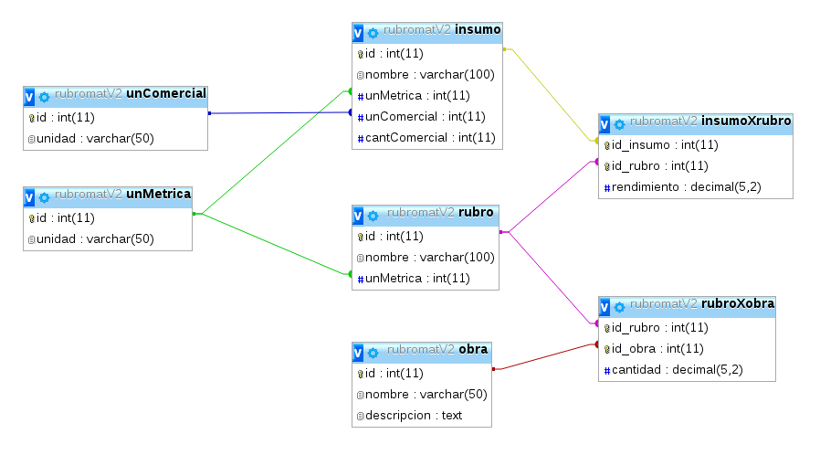
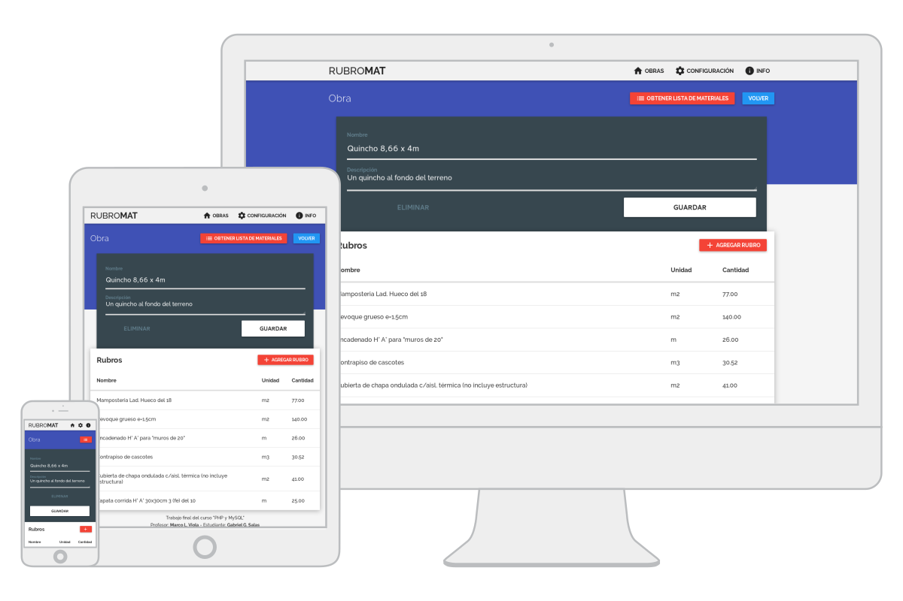

# rubromat
Calculate materials necessary to build architecture buildings

## Install
Needs to create a database with the backup file "Database.sql" and add the connection data on the "coneccionBd.php" file.
## Use
You can use this software on [this test server](http://rubromat.net16.net).
## Note
All the code and comments are written in spanish.

---

## Descripción
El principio básico del cómputo y presupuesto de obras de arquitectura es el análisis de precios. En RubroMAT a este análisis le denominamos "rubros".

Los **Rubros** se componen de insumos y éstos a su vez de materiales y mano de obra. Cada rubro posee una unidad de medida (Unidad métrica) que se refiere a la forma en que se debe medir el rubro, por ejemplo: las mamposterías y revoques se miden en metro cuadrado, los encadenados en metros lineales, el Hormigón en metros cúbicos, etc.

Un conjunto específico de Rubros se denomina **Obra**. Mediante la introducción de la cantidad de unidades métricas de cada Rubro, el programa puede calcular la cantidad de Insumos (materiales y mano de obra) para la obra indicada. La forma de hacerlo es:

Los **Insumos** poseen dos unidades: La **unidad métrica**, que se refiere a la manera en la cual se mide el material, y la **unidad de comercial** que se refiere a la unidad que se utiliza para la venta del material. A su vez, la unidad comercial requiere saber la cantidad mínima de venta, la cual llamamos **cantidad comercial**. Por ejemplo: el cemento se mide en kilos y se vende en la misma unidad pero la unidad mínima es la bolsa de 50Kg. Otro ejemplo son las varillas de acero para la construcción de hormigón armado: se miden en metros lineales pero se venden por unidad (varillas) que miden 12 metros lineales cada una.

Para que el listado de materiales considere la unidad comercial la forma de calcularlos queda definida por:

## Diseño del programa

### PHP

Se priorizó la reutilización de código mediante el uso de __include__ y de __funciones__. La estructura de las páginas es la siguiente:

- ESTRUCTURA
    - **header**: encabezado
    - **footer**: pie de página
    - **coneccionBd**: conección a la base de datos
- INSUMOS
    - **insumos**: lista de insumos
    - **insumoForm**: formulario
    - **insumoResultado**: resultado del formulario (redirección a insumoForm)
- RUBROS
    - **rubros**: lista de rubros
    - **rubroForm**: formulario
    - **rubroResultado**: resultado del formulario (redirección a rubroForm)
- OBRAS
    - **obras**: lista de obras
    - **obraForm**: formulario
    - **obraResultado**: resultado del formulario (redirección a obraForm)
    - **obraListamat**: calcula la lista de materiales que requiere la obra indicada. Exporta la lista a fomrmato .csv mediante el archivo **materiales.csv**.
- BUSCAR: mediante variables pasadas por GET y POST (según el caso) la página **Buscar.php** se utiliza para buscar:
    - Insumos y Rubros en general
    - Insumos y Rubros a insertar en el formulario **rubroForm** y **obraForm**. Para esto el link de cada resultado inserta el insumo/rubro en el formulario correspondiente. A su vez filtra los insumos/rubros que ya tiene el rubro/obra cada elemento puede estar solo una vez. La ventaja de utilizar una búsqueda se hace notable cuando la cantidad de elementos del menú desplegable es grande.
- OTRAS PAG:
    - Index
    - Info

### Diseño de la base de datos

La base de datos comprende **3 tablas principales**: insumo, rubro y obra, y **dos tablas accesorias**: unCmercial y unMetrica que poseen la relación uno a muchos con las tablas principales correspondientes. A su vez, las tablas principales se relacionan entre ellas mediante la relación muchos a muchos para lo cual se crean las dos tablas accesorias: **insumoXrubro y rubroXobra**. El esquema del diseño de la base de datos queda definido en el siguiente gráfico:

Y el resultado de la implementación de este diseño es el siguiente:

### Diseño gráfico Responsive

El diseño de RubroMAT está inspirado en [Google Material Design](https://www.google.com/design/spec/material-design/introduction.html). y verifica el correcto uso del programa desde una pantalla de PC y una pantalla de celular. A modo de ejemplo:

Los íconos utiliados son los que provee Google material design y están instalados localmente, mientras que la tipografía elegida, Raleway, se carga con conexión a internet o en su defecto se utiliza una sans-serif que el dispositivo tenga instalada.
